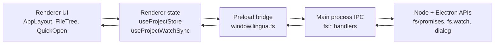
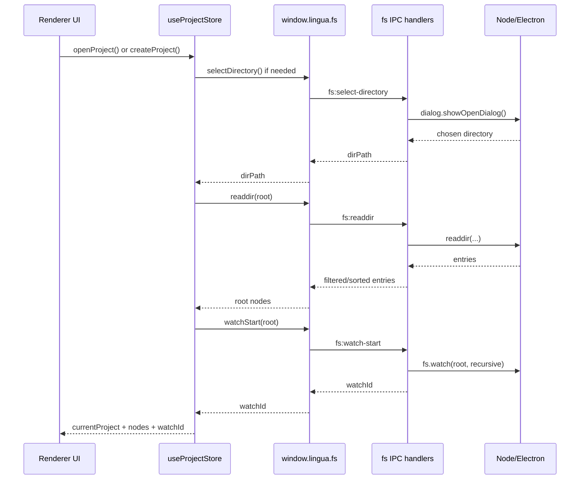

# Architecture

This page explains the part of Lingua that manages an opened project on disk:

- the **project lifecycle**
- the **Electron IPC file-system bridge**
- the **watch-state** that keeps the explorer synchronized with external changes

This is an **explanation** document. It focuses on how the architecture works, why it was designed this way, and how to extend it safely.

## At a glance

Lingua separates this feature into four layers:

1. The **renderer store and hooks** decide what the UI should show.
2. The **preload bridge** exposes a narrow `window.lingua.fs` API.
3. The **main process IPC handlers** perform trusted file-system work.
4. The **native platform** provides dialogs, file reads/writes, and watchers.

## Core concepts

The current project architecture revolves around four pieces of state in the renderer store:

| State | Meaning | Why it exists |
| --- | --- | --- |
| `currentProject` | Metadata for the currently opened root directory | Gives the renderer a single active project root |
| `recentProjects` | The recent-project list | Lets the app reopen known roots quickly without persisting the whole tree |
| `nodes` | The current in-memory file tree | Drives explorer rendering and quick-open traversal |
| `watchId` | The active desktop watcher handle | Lets the renderer stop the watcher when the active project changes |

Important design choice:

- `recentProjects` is persisted.
- `currentProject`, `nodes`, and `watchId` are **not** persisted.

Why:

- the tree is runtime state that should be re-derived from disk
- a watcher cannot be serialized meaningfully
- reopening into a stale project root after restart is riskier than starting clean

## Project lifecycle

### What “project lifecycle” means in this codebase

In Lingua, project lifecycle does **not** mean package management, workspace bootstrapping, or background indexing.

It means this narrower lifecycle:

1. Choose a directory.
2. Load its root entries.
3. Start a watcher for that root.
4. Expand, refresh, and mutate the tree while the project is open.
5. Stop the watcher and clear transient state when the project closes or switches.

The renderer entry point for this is [`useProjectStore`](./src/renderer/stores/projectStore.ts).

The pure tree helpers live in [`projectTree.ts`](./src/renderer/stores/projectTree.ts).

### Open flow

The happy path for opening a project looks like this:

### What each lifecycle method does

#### `createProject()`

Current behavior:

- opens the native directory picker with Electron's `createDirectory` capability enabled
- delegates the actual open work to `openProject(dirPath)`
- renames the visible project label to the chosen directory basename

Important nuance:

- this does **not** scaffold a project structure
- it is effectively “pick or create a directory, then open it”

#### `openProject(dirPath?)`

This is the central lifecycle transition.

It does five important things:

1. Resolves the target root path.
2. Stops any previous watcher via `watchStop(watchId)`.
3. Reads the root directory with `readdir`.
4. Starts a new watcher with `watchStart(rootPath)`.
5. Replaces `currentProject`, `nodes`, `watchId`, and updates `recentProjects`.

Technical reason for doing all of this in one action:

- it keeps “active root”, “active tree”, and “active watcher” aligned as one atomic state transition

#### `refreshTree()`

`refreshTree()` rebuilds the visible tree from disk while preserving the user's expanded directories.

It works like this:

1. Collect expanded directory paths from the current in-memory tree.
2. Re-read the project root.
3. Recursively reload only the directories that were previously expanded.
4. Replace `nodes` with the rebuilt tree.

Technical reason:

- this gives the renderer a fresh snapshot from disk without collapsing the user's navigation context

#### `closeProject()`

This method:

- stops the current watcher if one exists
- clears `currentProject`
- clears `nodes`
- clears `watchId`

Technical reason:

- the watcher must stop before the renderer forgets which project it owns
- otherwise the app risks sending watch events into a UI that no longer considers that root active

### Tree navigation and file operations

The lifecycle continues after open through three categories of store actions:

#### Tree navigation

- `expandDirectory(dirPath)` reads that directory lazily and inserts its children
- `collapseDirectory(dirPath)` only toggles the expanded flag

Why lazy expansion is used:

- large projects do not need a full recursive read on first open
- explorer performance stays proportional to what the user actually opens

#### File creation

- `createFile(parentPath, name)` calls `touch`, then appends a file node locally
- `createDirectory(parentPath, name)` calls `mkdir`, then appends a directory node locally

Why local mutation is used after successful IPC:

- the user sees the new node immediately
- there is no need to trigger a full tree refresh for a known deterministic change

#### Delete and rename

- `deleteEntry(...)` calls IPC delete, then removes the node if the deletion succeeded
- `renameEntry(...)` calls IPC rename, then updates the node path/name locally

Why this is not purely watch-driven:

- user-initiated operations already know what changed
- waiting for a watcher round-trip would make the UI feel slower and less predictable

## IPC file-system bridge

### What is used

This project uses Electron's secure preload + IPC model:

- `contextIsolation: true`
- `nodeIntegration: false`
- `sandbox: true`
- `contextBridge.exposeInMainWorld(...)`
- `ipcRenderer.invoke(...)` / `ipcMain.handle(...)`
- `ipcRenderer.on(...)` for push-style change events

The bridge is defined in [`src/preload/index.ts`](./src/preload/index.ts).

The handlers are registered from [`src/main/index.ts`](./src/main/index.ts), mainly through [`src/main/ipc/fileSystem.ts`](./src/main/ipc/fileSystem.ts).

### Why IPC is used here

The renderer intentionally does **not** touch Node's file system directly.

Technical reasons:

- the renderer stays closer to a browser execution model
- the file system becomes a single trust boundary in the main process
- path validation and destructive-operation safeguards live in one place
- desktop and web can share the same `LinguaAPI['fs']` shape even though the implementations differ

### Request/response operations

Most file operations use `invoke/handle` because they are command-like and need a result:

| Preload method | IPC channel | Main responsibility |
| --- | --- | --- |
| `selectDirectory()` | `fs:select-directory` | open native directory picker |
| `selectFile()` | `fs:select-file` | open native file picker |
| `readdir(dirPath)` | `fs:readdir` | list entries, filter hidden items, sort dirs first |
| `stat(filePath)` | `fs:stat` | return metadata |
| `read(filePath)` | `fs:read` | safe read with path checks |
| `write(filePath, content)` | `fs:write` | safe write |
| `delete(filePath, isDirectory)` | `fs:delete` | guarded delete with confirmation dialog |
| `rename(oldPath, newName)` | `fs:rename` | validated rename inside the same parent |
| `mkdir(dirPath)` | `fs:mkdir` | safe directory creation |
| `touch(filePath)` | `fs:touch` | create empty file |
| `watchStart(dirPath)` | `fs:watch-start` | create native watcher |
| `watchStop(watchId)` | `fs:watch-stop` | close native watcher |

### Event-style IPC

The one push-style channel in this architecture is:

- `fs:changed`

Flow:

1. The main process listens with `fs.watch(...)`.
2. When Node emits an event, the main process sends `fs:changed` back to the originating renderer.
3. The preload bridge exposes that as `window.lingua.fs.onChanged(callback)`.
4. The renderer hook decides whether to refresh the active project tree.

This split is important:

- `invoke/handle` is used for explicit user commands
- `onChanged` is used for asynchronous external changes

### Security and safety layer

The file-system IPC handlers are not just thin pass-through wrappers.

They also enforce:

- blocked system/sensitive paths through [`src/main/ipc/permissions.ts`](./src/main/ipc/permissions.ts)
- safe entry names for rename operations
- confirmation dialogs for destructive deletes
- hidden-entry filtering for explorer cleanliness

Technical reason:

- once the renderer can request disk operations, the main process becomes the correct place to centralize guardrails

## Watch-state

### What watch-state means here

Watch-state is the coordination between:

- the active root watcher in the main process
- the `watchId` stored in the renderer project store
- the debounced refresh hook in the renderer

It exists to keep the explorer coherent when something changes on disk outside the current UI action.

Typical examples:

- a file is edited by another tool
- a folder is created in Finder/Explorer
- a build process writes generated files

### Desktop watch flow

The desktop watch flow is:

1. `openProject()` starts a watcher on the project root.
2. The main process stores a stop function in a `Map`.
3. Node's `fs.watch` emits coarse change events.
4. The main process forwards them as `fs:changed`.
5. `useProjectWatchSync()` debounces the burst.
6. The renderer calls `refreshTree()`.
7. `refreshTree()` rebuilds the tree while preserving expanded paths.

### Why the watch ID is the project root path

The current implementation returns the watched root path itself as the watcher ID.

That works because:

- the app only needs one watcher per project root
- watchers are internally keyed by directory path in the main-process `Map`
- stopping a watcher conceptually means “stop watching this root”

This is intentionally simple. It is not trying to model multiple independent watchers under the same root.

### Why watch events trigger a full refresh instead of patching a node

This is one of the most important technical choices in the feature.

Node's `fs.watch` is useful, but not precise enough to drive tree mutations directly across platforms:

- rename events can mean create, delete, or rename
- some platforms coalesce events
- some tools emit bursts for a single conceptual action
- the watcher gives `filename`, but not a normalized semantic diff

So the project does **not** try to interpret the raw event stream as truth.

Instead it treats watch events as an invalidation signal:

- “something changed under this root”
- debounce
- rebuild the relevant visible tree state from disk

Why this is technically safer:

- avoids platform-specific watcher logic in the renderer
- avoids stale or partially applied local tree patches
- keeps the architecture deterministic even if the event stream is noisy

### Debounce behavior

The debounce currently lives in [`src/renderer/hooks/useProjectWatchSync.ts`](./src/renderer/hooks/useProjectWatchSync.ts).

Current value:

- `PROJECT_WATCH_REFRESH_DEBOUNCE_MS = 150`

Why debounce is used:

- external tools often emit multiple watch events for one change
- refreshing on every raw event would cause repeated `readdir` bursts and visual churn

### Where the watch subscription lives

The watch subscription is attached once near the top of the renderer app in [`src/renderer/App.tsx`](./src/renderer/App.tsx).

Why this is useful:

- the subscription survives normal layout/component swaps
- explorer synchronization is app-level infrastructure, not a local component concern

## Desktop vs web behavior

The `fs` API is intentionally shaped so the renderer can call the same surface in desktop and web.

However the watch semantics are different:

| Capability | Desktop | Web |
| --- | --- | --- |
| Real directory picker | Yes | Yes, via File System Access API |
| Read/write/create/delete | Yes | Yes, adapter-backed |
| Native recursive watcher | Yes | No |
| `onChanged` events | Yes | No-op |

The web implementation is in [`src/web/fs-adapter.ts`](./src/web/fs-adapter.ts).

Important limitation:

- `watchStart`, `watchStop`, and `onChanged` are deliberate no-ops in the browser adapter

Why:

- the browser does not provide a native recursive file watcher equivalent here
- pretending otherwise would create an unreliable contract

## How to extend this architecture

### If you add a new file-system operation

Follow this path:

1. Add or update the type in [`src/types.d.ts`](./src/types.d.ts).
2. Expose it in [`src/preload/index.ts`](./src/preload/index.ts).
3. Implement the handler in [`src/main/ipc/fileSystem.ts`](./src/main/ipc/fileSystem.ts).
4. Decide whether the web adapter should support it in [`src/web/fs-adapter.ts`](./src/web/fs-adapter.ts).
5. Call it from renderer state or hooks, not directly from many UI components.

Reason:

- this keeps the API explicit and preserves desktop/web parity as much as possible

### If you want richer project lifecycle behavior

Common extensions might be:

- restoring the last open project on app launch
- storing per-project settings
- adding project bootstrap templates
- tracking file metadata such as dirty-from-disk or external-delete state

Recommended approach:

- keep `useProjectStore` as the lifecycle orchestrator
- keep pure tree math in `projectTree.ts`
- keep file access in IPC

Reason:

- lifecycle policy, tree mutation logic, and trusted file I/O are different responsibilities

### If you want richer watch behavior

You have two realistic options:

#### Option 1: Stay with coarse invalidation

Improve stability without changing the contract:

- normalize duplicate events
- tune debounce timing
- ignore hidden or generated paths earlier

Best when:

- you want reliability more than granular live updates

#### Option 2: Introduce semantic watch events

This would be a larger redesign:

- normalize raw watcher events in the main process
- emit richer payloads such as `created`, `deleted`, `renamed`
- teach the renderer how to patch `nodes` incrementally

Best when:

- you truly need large-project performance beyond full visible-tree refreshes

Risk:

- cross-platform watcher behavior becomes part of your application logic

### If you want multiple watchers per project

Today the app assumes one root watcher per active project.

If that changes, you will need to redesign:

- the `watchers` map key/value model in the main process
- the meaning of `watchId`
- the stop/replacement policy in `openProject()` and `closeProject()`

Do not change only one side of that contract.

## What is intentionally not part of this architecture yet

To avoid confusion, these are **not** currently implemented as part of project lifecycle:

- package management or dependency resolution
- project indexing or symbol databases
- multi-root workspaces
- automatic restore of the last open project
- per-file live watch subscriptions
- semantic watcher diffs in the renderer

That absence is deliberate. The current design optimizes for:

- safety
- deterministic refresh behavior
- clear trust boundaries
- desktop/web API shape consistency

## Mental model to keep

The easiest way to reason about this architecture is:

- the **renderer** owns user-facing state
- the **preload** owns the safe API surface
- the **main process** owns trusted file access and watcher registration
- the **watcher** is only an invalidation signal
- the **disk** is the final source of truth

If you keep that model, future extensions tend to stay coherent.
