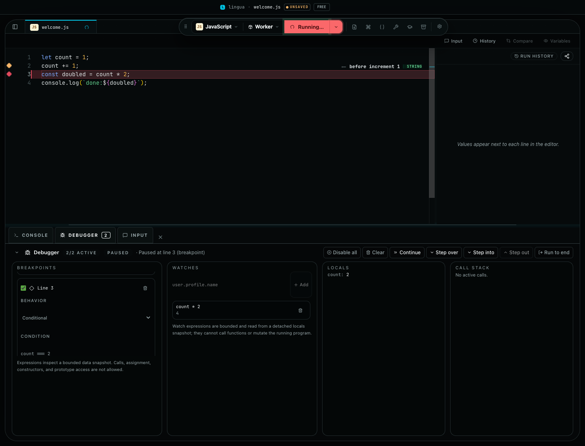
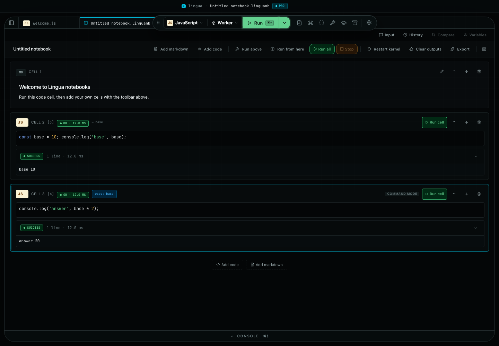
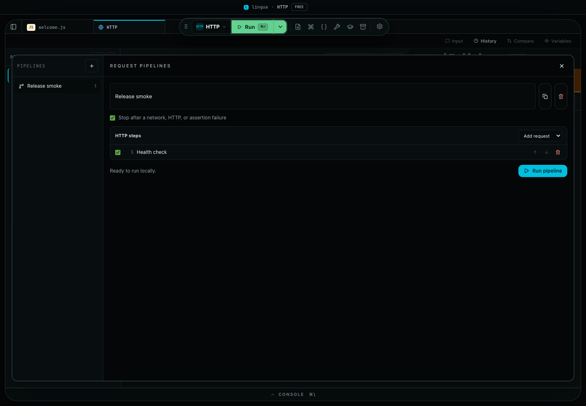
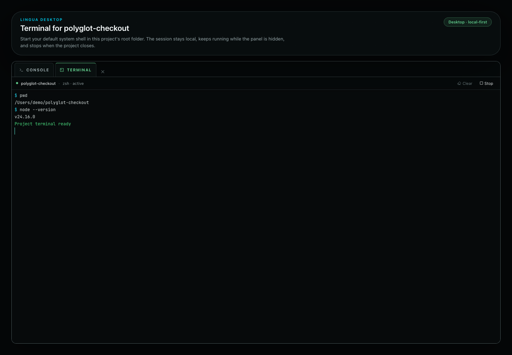
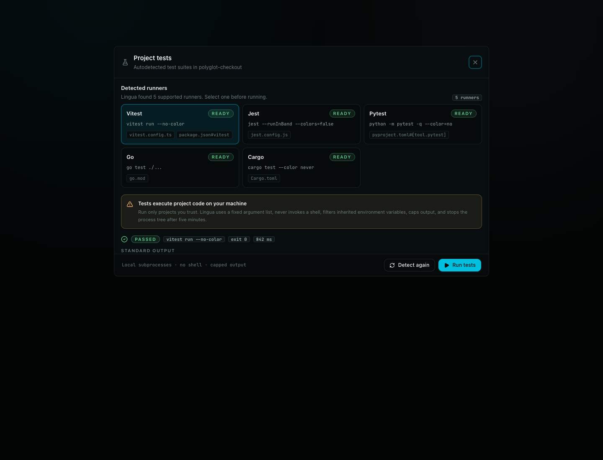
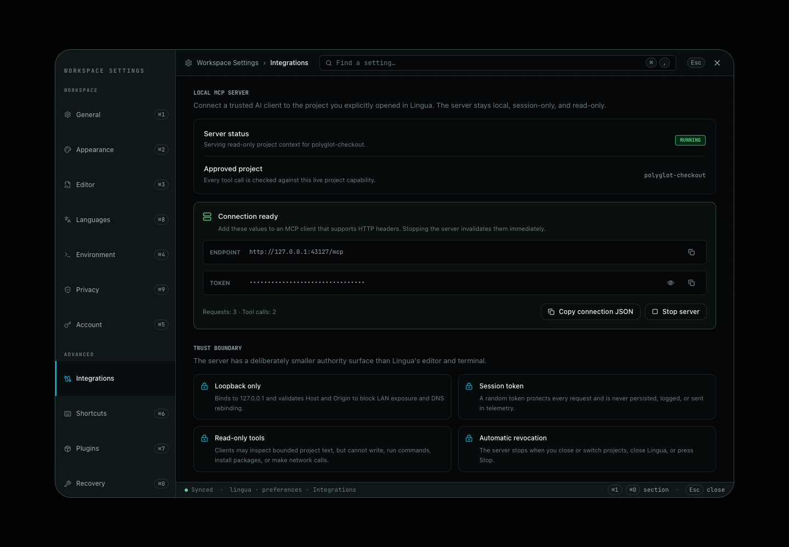

# Lingua

[](https://github.com/johnny4young/lingua/actions/workflows/ci.yml)
[](https://nodejs.org)
[-6f42c1)](./LICENSE)

**Multi-language desktop code runner — JavaScript, TypeScript, Python, Go, Rust, and Ruby in one offline-first Monaco-powered app.** Lingua combines Monaco Editor, a project file tree, inline console output, and language-specific execution backends for both desktop and web builds. It is the multi-language answer to RunJS: the same "open, write, run" ergonomics, but with Go, Rust, Python, and Ruby as first-class citizens instead of JavaScript-only.

**Marketing site:** [linguacode.dev](https://linguacode.dev) — downloads, pricing, press kit, language-specific landing pages.
**Web app:** [app.linguacode.dev](https://app.linguacode.dev) — the in-browser build.

Both web surfaces build and deploy **from this repo** to Cloudflare Pages (two separate deploys, two Pages projects):

- **Web app** → [app.linguacode.dev](https://app.linguacode.dev): the Vite `dist/web` build, deployed by [`.github/workflows/deploy-web.yml`](./.github/workflows/deploy-web.yml) (Cloudflare Pages project `lingua-app`).
- **Marketing site** → [linguacode.dev](https://linguacode.dev): a standalone Astro package under [`website/`](./website), deployed by [`.github/workflows/deploy-website.yml`](./.github/workflows/deploy-website.yml) (Cloudflare Pages project `lingua-web`).

## Install

**macOS** — Homebrew tap (Apple Silicon and Intel):

```bash
brew install --cask johnny4young/tap/lingua
```

**Any platform** — the signed macOS builds, the Windows installer, and the Linux
AppImage are attached to the
[latest GitHub Release](https://github.com/johnny4young/lingua/releases/latest)
next to `SHA256SUMS.txt`, so you can verify exactly what you downloaded. macOS
builds are Developer ID signed and notarized. The Windows installer is not
Authenticode signed yet, so SmartScreen shows a warning you have to accept.

**Nothing to install** — the browser build runs at
[app.linguacode.dev](https://app.linguacode.dev), with Go and Rust disabled
because those toolchains do not exist in a browser.

## Pricing and licensing

Lingua is a commercial product distributed under a source-available license — see [`LICENSE`](./LICENSE) for the full text. The repository is public so the community can read the source, audit security, and submit contributions; production, paid, hosted, redistributed, educational-at-scale, or other commercial use requires a separate commercial license from the Licensor. The public checkout and download surface is live at [`linguacode.dev`](https://linguacode.dev); the rights granted by this repository remain those described in `LICENSE`.

Public tiers:

- **Free** — personal evaluation, self-learning, single-user non-commercial local use.
- **Monthly** ($5/month) — paid subscription unlocking the full feature set.
- **Pro** ($59 once) — a perpetual paid entitlement that never expires, with 12 months of included updates and no recurring subscription; renewal is optional if you want later releases.
- **Education** — free, renewable, in-app verification for verified students and educators.

The public pricing summary lives at [`linguacode.dev/pricing`](https://linguacode.dev/pricing) (canonical surface) and mirrors [`docs/press-kit/pricing-one-pager.md`](./docs/press-kit/pricing-one-pager.md) for in-repo reference.

## Who it is for

- Developers juggling JavaScript, TypeScript, Python, Ruby, Go, and Rust snippets across Slack, Stack Overflow answers, and interview prep.
- Teachers and students who want a single offline-capable multi-language sandbox that runs on laptops without per-language CLI setup.
- Teams who need a lightweight, reviewable, commercial-licensed alternative to web-hosted playgrounds for proprietary code.

## Lingua 1.0 at a glance

These are deterministic captures from the current product build, not design mockups. The website presents the same journeys in English and Spanish and labels each one by platform and tier.

<table>
  <tr>
    <td width="50%"><br /><strong>Debugger</strong> — breakpoints, stepping, watches, locals, and call stacks.</td>
    <td width="50%"><br /><strong>Reactive notebooks</strong> — explicit stale-state tracking and replay across languages.</td>
  </tr>
  <tr>
    <td width="50%"><br /><strong>HTTP pipelines</strong> — requests, live transports, captures, assertions, and repeatable flows.</td>
    <td width="50%"><br /><strong>Project terminal</strong> — an explicit local-shell boundary rooted in the approved project.</td>
  </tr>
  <tr>
    <td width="50%"><br /><strong>Project tests</strong> — detected commands, live bounded output, and stop control.</td>
    <td width="50%"><br /><strong>Local MCP</strong> — a project-scoped, read-only doorway for trusted AI clients.</td>
  </tr>
</table>

## Current capabilities

- Desktop app (Electron + Vite + React 19 + TypeScript, packaged with electron-builder and auto-updating from GitHub Releases) and a parallel web build for browser-based usage.
- Monaco-powered editor with tabs, templates, inline execution results, magic-comment value surfacing (with `// @` completions and hover docs), inline per-line timing via `// @time` (each top-level statement shows its wall-clock duration, slowest line highlighted), command palette with a Cmd+; recent-commands stack, quick open, project-wide search, and snippet library.
- **JavaScript and TypeScript debugger**: click-to-toggle pause, conditional, or logpoint markers in the Monaco gutter; step over/into/out, inspect locals and call stacks, and keep watch expressions refreshed at every pause. Conditions, watches, and `{expression}` log placeholders run through a bounded data-only interpreter rather than `eval` or `Function`.
- **Smart paste**: pasting a share link, run capsule, cURL command, stack trace, or large JSON offers a one-click import to the right surface — and single values (JWT, UUID, color, Unix timestamp, cron expression, Base64, JSON snippets) offer to open pre-loaded in the matching developer utility.
- **No-backend share links**: the result-panel share button encodes one bounded tab as a gzip-compressed, base64url URL fragment under `https://app.linguacode.dev/#share=v1.…`. The recipient previews and opens it locally; no database, upload, file path, environment value, license token, or execution result is included.
- **Run Capsules**: portable, redacted JSON captures of a run (source, output, input, environment) with confirm-first import, a Pro capsule browser with compare, and one-click export to a self-contained syntax-highlighted HTML document. When a run needs a few related files, Capsule Workspaces package explicitly selected open text tabs behind an exact-source privacy review and reopen them inertly, with no backend or filesystem crawl.
- **AI assistance (Pro, bring-your-own-key)**: an opt-in, local-first assistant that never sends anything without an explicit action and an exact-payload preview. Explain selected editor code or any failing surface (notebook cell, editor console, SQL query, HTTP request) with streaming answers, follow-up questions, and runtime-aware fixes; Apply & re-run applies a suggested fix behind a diff preview and re-runs; Ask AI turns natural language into SQL using only the live schema (never rows). Point it at a local model (Ollama / LM Studio) so code never leaves the machine, or at any OpenAI-compatible endpoint — Lingua ships no default key or endpoint and makes no background calls.
- **Notebook mode**: literate, multi-cell notebooks running TypeScript, Python (a persistent per-notebook kernel that shares imports and variables across cells), and SQL on the shared DuckDB engine; edits mark affected executed cells stale across languages, preserve old output, and refresh only on an explicit replay; homogeneous arrays render as tables; lossless export/import supports native `.linguanb` and Jupyter `.ipynb`.
- **Confirm-first playground import**: paste a TypeScript Playground share link to decode it locally, or a Go Playground link to fetch only its official bounded plain-text source. Lingua shows the code before creating a tab, sends no URL or source through telemetry, rejects redirects and unsupported providers, and documents the exact network contract in the [import guide](./docs/IMPORTING.md).
- **SQL workspace**: a DuckDB-WASM query workspace with a Monaco SQL editor, a column-aware schema browser and autocomplete, CSV/JSON/Parquet import as queryable tables, an on-demand Column Explorer that profiles a result's columns locally (type, null %, cardinality, min/max/avg/stddev) through DuckDB `SUMMARIZE`, opt-in OPFS persistence, and CSV/JSON/Markdown result export.
- **Run Ledger**: an opt-in, local, queryable history of your manual runs, stored in the same DuckDB database the SQL workspace uses (schema `lingua_ledger`) so your history *is* a table you can query. Source code never touches the database — only a SHA-256 hash and redacted, length-capped stdout previews; Free keeps 7 days and paid tiers keep everything, with one-click Clear (drops the schema) and Export (every table as JSON). Off by default; enable it in Settings → Account.
- **HTTP workspace**: compose HTTP requests, open bounded SSE/WebSocket sessions, and run named sequential request pipelines with reusable secret-aware `{{variable}}` environments. Response captures chain values into later steps, assertions can stop a pipeline, and cURL/Postman plus Bruno file/folder import stay local; see the [import guide](./docs/IMPORTING.md). Desktop networking uses an SSRF-guarded, DNS-pinned proxy with per-redirect checks and an explicit private-host opt-in. Copy-as-code supports cURL, `fetch`, `axios`, and Python `requests`.
- Built-in runners for JavaScript, TypeScript, Python (Pyodide), Go (compiled locally to WASM), Rust (`rustc` native subprocess on desktop), and Ruby (hybrid: bundled `@ruby/wasm-wasi` worker everywhere, system `ruby` subprocess on desktop when preferred) — with a live download counter while a WASM runtime boots and actionable install-and-retry guidance when a native toolchain is missing.
- **Desktop Node runtime**: switch any JavaScript or TypeScript tab to the local Node runtime for the full standard library (`fs`, `path`, `http`) and `require()` of every package already installed in the project's `node_modules` — the runner walks up from a saved tab's directory to find it. Node is spawned directly (never through a shell) with an allow-listed environment, a parent-owned timeout, and capped output; both ESM and CJS are detected from the file extension, the source syntax, and the nearest `package.json#type`.
- **Project test runner (desktop)**: open the Explorer's flask action to autodetect Vitest, Jest, Pytest, Go, and Cargo suites, compare the exact command and configuration evidence, then run one suite with live stdout/stderr and Stop. Main revalidates the approved project root immediately before a fixed no-shell spawn, filters inherited environment variables, caps output, and enforces a five-minute timeout; the first run makes the unsandboxed local-code boundary explicit.
- **Integrated project terminal (desktop)**: open a real interactive system shell from the Explorer, Command Palette, or contextual bottom panel. It starts only after explicit confirmation in the approved project root, uses a filtered environment, retains a bounded in-session transcript, and stops with the project, renderer, or app. The root is a starting directory rather than a sandbox, so the UI makes the user's full OS permissions explicit; web does not advertise the unavailable bridge.
- **Local MCP server (desktop)**: connect a trusted AI client to only the project you explicitly opened. The loopback-only endpoint uses an ephemeral session token and exposes four bounded, read-only tools for project metadata, visible-file listing, UTF-8 reads, and literal search; secret-like and binary paths stay blocked, and closing the project or app revokes the server.
- Validate-only modes for JSON, YAML, `.env`, CSV, Dockerfile, `.editorconfig`, `.gitignore`, `Makefile`; view-only handling for TOML and INI/config files.
- 31 focused developer-utility panels (JSON, regex, Base64/URL/UUID/hash/timestamp/JWT, color, diff, beautify/minify, case/encoding, QR, Lorem, mock data, SVG→CSS, HTML→JSX, cURL→code, YAML↔JSON, JSON↔CSV, Markdown preview, SQL formatter, utility pipelines) reachable from the toolbar wrench and the Command Palette.
- Format-on-save via Prettier (JS/TS/JSON/CSS) plus desktop-only gofmt, rustfmt, and Python formatters (ruff preferred, black fallback).
- Curated developer fonts with a ligature toggle, theme presets with versioned JSON export/import, persisted resizable shell layout with a compact-shell drawer for narrow widths, a one-keystroke presenter mode (Cmd+Alt+P) that hides the chrome and enlarges the fonts for demos, and a What's New overlay backed by [`CHANGELOG.md`](./CHANGELOG.md).
- Built-in guided onboarding tour, a practice Recipes library (JavaScript, TypeScript, and Python) with real Run + Test execution, rotating platform-aware tips on empty surfaces, customizable keyboard shortcuts with preset switching and JSON export/import, and `lingua://` deep links for `open`, `new`, and `snippet` entry points.
- Commercial license-key infrastructure: Ed25519-signed offline-verifiable tokens, renderer store with active/grace/invalid states, and entitlement-based feature gating. Free includes 3 open tabs, 5 saved snippets, JavaScript/TypeScript/Python/Ruby, and every single-shot developer utility; Pro unlocks unlimited tabs and snippets, Go and Rust, the bring-your-own-key AI assistance, and the utility workflows (multi-step pipelines, history that persists across reloads, and clipboard-on-focus automation).
- Opt-in privacy-respecting telemetry and crash reporting, off by default, with an explicit allow-list redactor (never user code or file paths) and build-level kill switches.

## Runtime model

- JavaScript and TypeScript run in renderer workers; Monaco diagnostics target the same ES2022 + Web Worker contract used by execution.
- Python runs through Pyodide in both the desktop app and the web build.
- Go is compiled to WebAssembly through the desktop IPC bridge and a local Go toolchain.
- Rust is compiled and executed natively through the desktop IPC bridge and a local Rust toolchain.
- Ruby is hybrid: a bundled `@ruby/wasm-wasi` worker runs everywhere, and the desktop app can dispatch to the system `ruby` instead (Settings → Editor → Ruby runtime: auto / system / wasm).
- Project test suites run only in the desktop app through capability-scoped main-process IPC; the web build does not expose a host-process bridge.
- The integrated terminal runs only in desktop through an owner-bound pseudoterminal; it starts in the approved project root but remains the user's real unsandboxed shell.
- SQL runs on DuckDB-WASM locally in both the desktop app and the web build (the web build fetches the oversized runtime from the download mirror); the same engine backs the SQL workspace and notebook SQL cells.
- AI assistance talks only to the endpoint you configure — a local model or any OpenAI-compatible provider — with an explicit, per-invocation payload preview; nothing is sent in the background and Lingua ships no default key or endpoint.
- The web build stubs Go and Rust execution because local toolchains are not available in the browser.

For deeper architecture detail and the per-capability execution-class decision, see [`docs/ARCHITECTURE.md`](./docs/ARCHITECTURE.md) and [`docs/CAPABILITY_MATRIX.md`](./docs/CAPABILITY_MATRIX.md).

## Use Lingua from the terminal

The desktop app is the fastest place to explore. The `lingua` CLI is the part
you reach for after an experiment becomes repeatable: format JSON in a pipe,
run a trusted script, validate a Run Capsule in CI, or replay a captured run
without starting Electron.

```bash
# Transform stdin with the same utility adapter used by the app
echo '{"name":"Lingua","ready":true}' | lingua utility json-format

# Run a local file; everything after -- belongs to your program
lingua run ./scripts/check.ts --timeout 60000 -- --verbose

# Validate a Run Capsule without executing its source
lingua capsule validate ./run.capsule.json --json
```

Install it from npm — the package is dependency-free and needs Node 24.x:

```bash
npm install -g @linguacode/cli
lingua --help
```

Or run it once without installing:

```bash
npx @linguacode/cli utility json-format
```

Every stable release also attaches standalone
`lingua-cli-v<version>-linux-x64.tar.gz` and `-windows-x64.tar.gz` archives to
the [GitHub Release](https://github.com/johnny4young/lingua/releases/latest) for
machines without Node. Contributors can build and link it from this repository
instead:

```bash
pnpm install
pnpm run build:cli
pnpm link --global
lingua --help
```

The CLI runs locally and does not load the desktop UI. Code launched through
`lingua run` still has your operating-system permissions, so run only source
you trust or place the CLI inside your own sandbox. See the
[human CLI guide](https://linguacode.dev/cli) for task-based walkthroughs,
search, examples, and troubleshooting, or [`docs/CLI_USAGE.md`](./docs/CLI_USAGE.md)
for the exact command and exit-code contract.

## Requirements

| Dependency     | Version | Notes                                                          |
| -------------- | ------- | -------------------------------------------------------------- |
| Node.js        | 24.x    | Required for local development, tests, and builds              |
| pnpm           | >= 11   | Package manager (`corepack enable` picks the pinned version)   |
| Go             | >= 1.21 | Required only for desktop Go execution                         |
| Rust (`rustc`) | stable  | Required only for desktop Rust execution                       |
| Ruby           | any     | Optional — desktop system-Ruby mode; the bundled WASM runtime needs nothing |

## Quickstart

```bash
git clone https://github.com/johnny4young/lingua.git
cd lingua
pnpm install
pnpm run dev:desktop
```

Common commands:

```bash
pnpm run dev:web          # browser-only iteration
pnpm run dev:desktop      # real Electron app + renderer dev server
pnpm run dev:web:pro      # web build with throwaway dev license token printed
pnpm run dev:desktop:pro  # desktop build with throwaway dev license token printed
pnpm run smoke:desktop    # repeatable Electron smoke across the native runtime matrix (JS, TS, Python, Go, Rust)
pnpm run build:web        # static web build for app.linguacode.dev
```

Full contributor workflow — quality checks, i18n contributor flow, UI smoke against the web preview, desktop launcher flags, packaged-app smoke variants, build commands, automation/delivery — lives in [`docs/DEVELOPMENT.md`](./docs/DEVELOPMENT.md).

End-user reference — keyboard shortcuts, `lingua://` deep links, plugin manifest format, browser-only limitations, browser file access, update behavior — lives in [`docs/USAGE.md`](./docs/USAGE.md).

### Windows contributors: enable symlinks before cloning

`CLAUDE.md` is a git symlink (`mode 120000`) that points at `AGENTS.md`. Linux and macOS follow it transparently. Windows needs one-time setup so git materializes it as a real symlink instead of a text file containing the word `AGENTS.md`:

1. Enable **Developer Mode** (Settings → Privacy & security → For developers → Developer Mode on).
2. `git config --global core.symlinks true` before `git clone`.

Without this, `CLAUDE.md` still works as a pointer — it just shows up as a regular text file containing `AGENTS.md`. Edit `AGENTS.md` in either case; never edit the symlink.

## Where to read next

Contributor and operator entry points:

- [`docs/DEVELOPMENT.md`](./docs/DEVELOPMENT.md) — clone/install, dev/test/smoke/build commands, Pro testing, automation/delivery.
- [`docs/USAGE.md`](./docs/USAGE.md) — keyboard shortcuts, deep links, plugin manifest format, browser-only limitations, update behavior.
- [`docs/CLI_USAGE.md`](./docs/CLI_USAGE.md) — headless commands, flags, JSON output, exit codes, and CI patterns.
- [`AGENTS.md`](./AGENTS.md) — canonical guidance for any agent (Claude Code, Cursor, Codex, Aider) working in this repo. `CLAUDE.md` is a symlink pointing to it.
- [`RELEASE.md`](./RELEASE.md) — release operator checklist (preconditions, release steps, validation gate, rollback plan).

Architecture and decision records:

- [`docs/ARCHITECTURE.md`](./docs/ARCHITECTURE.md) — process model, IPC filesystem bridge, watch-state, project lifecycle.
- [`docs/CAPABILITY_MATRIX.md`](./docs/CAPABILITY_MATRIX.md) — which execution class owns each capability today, with promotion rules.
- [`docs/README.md`](./docs/README.md) — full ADR index (build system, debugger, env vars, language packs, Tauri spike, Vim mode, runtime assets).
- [`src/renderer/README.md`](./src/renderer/README.md) — renderer folder map, state ownership, styling rules.

Public-release and security:

- [`docs/PUBLIC_RELEASE_CHECKLIST.md`](./docs/PUBLIC_RELEASE_CHECKLIST.md) — gates for changing the source repository visibility to public.
- [`docs/RELEASE_SECURITY.md`](./docs/RELEASE_SECURITY.md) — public-release security sign-off checklist.
- [`SECURITY.md`](./SECURITY.md), [`PRIVACY.md`](./PRIVACY.md), [`CONTRIBUTING.md`](./CONTRIBUTING.md), [`THIRD_PARTY_NOTICES.md`](./THIRD_PARTY_NOTICES.md) — public security reporting, privacy posture, contribution rules, runtime dependency notices.

Launch and product collateral:

- [`docs/press-kit/`](./docs/press-kit/) — bilingual product descriptions, pricing reference, founder bio, and launch-channel drafts.
- [`docs/seo-pages/`](./docs/seo-pages/) — SEO landing page scaffolds (five language-intent pages) consumed by `linguacode.dev`.
- [`docs/lessons/`](./docs/lessons/) — first-slice guided lesson scaffolds (en + es).

## Glossary

Project-specific acronyms used throughout this repository:

- **ADR** — Architecture Decision Record. Markdown files under [`docs/`](./docs/) that capture the _why_ behind a design choice (e.g. [`docs/RUNTIME_MODES_ADR.md`](./docs/RUNTIME_MODES_ADR.md)).
- **IPC** — Inter-Process Communication. Electron's main ↔ renderer message bridge that backs the filesystem, language toolchains, and license verification. See [`docs/ARCHITECTURE.md`](./docs/ARCHITECTURE.md).
- **WASM** — WebAssembly. The bytecode format used to run Go through the desktop bridge and to host the Python (Pyodide) runtime in both desktop and web builds.
- **JWT** — JSON Web Token. Wire shape of Lingua's offline-verifiable Ed25519-signed license tokens.
- **JWK** — JSON Web Key. Public-key encoding embedded at build time (`VITE_LINGUA_LICENSE_PUBLIC_KEY_JWK`) and used by the renderer to verify those tokens.
- **SEO** — Search Engine Optimization. Discoverability scaffolding for the language-intent landing pages under [`docs/seo-pages/`](./docs/seo-pages/), consumed by [linguacode.dev](https://linguacode.dev).

## License

Lingua is a commercial product distributed under a source-available license. The full terms live in [`LICENSE`](./LICENSE); the short version is: the repository is public for evaluation, contributor review, and security auditing, but production, paid, hosted, redistributed, educational-at-scale, or other commercial use requires a separate commercial license from the Licensor. The public checkout is live at [`linguacode.dev`](https://linguacode.dev). Redistributing packaged binaries or competing hosted offerings is not permitted.
