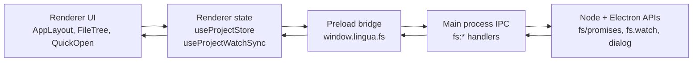
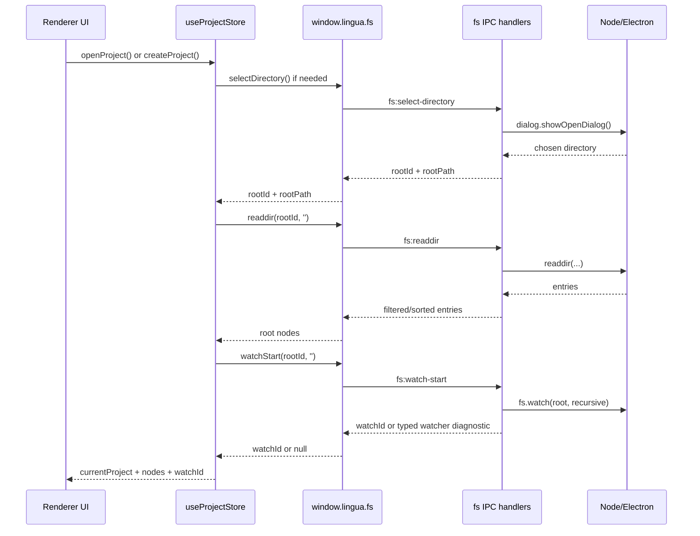

# Architecture

This page explains the part of Lingua that manages an opened project on disk:

- the **project lifecycle**
- the **Electron IPC file-system bridge**
- the **watch-state** that keeps the explorer synchronized with external changes

This is an **explanation** document. It focuses on how the architecture works, why it was designed this way, and how to extend it safely.

Related reference:

- [`src/renderer/README.md`](../src/renderer/README.md) documents the renderer folder map, state ownership, shared styling rules, and common UI change paths.
- [`CAPABILITY_MATRIX.md`](./CAPABILITY_MATRIX.md) records which execution class (browser WASM, browser interpreter, desktop native, or hybrid) owns each capability and the promotion rules for moving between classes.
- [`BUILD_SYSTEM_ADR.md`](./BUILD_SYSTEM_ADR.md) captures the "stay on Electron Forge vs. migrate to electron-vite or electron-builder" decision for the desktop build pipeline, and the triggers that should reopen the question.

## At a glance

Lingua separates this feature into four layers:

1. The **renderer store and hooks** decide what the UI should show.
2. The **preload bridge** exposes a narrow `window.lingua.fs` API.
3. The **main process IPC handlers** perform trusted file-system work.
4. The **native platform** provides dialogs, file reads/writes, and watchers.



## Core concepts

The current project architecture revolves around four pieces of state in the renderer store:

| State            | Meaning                                          | Why it exists                                                             |
| ---------------- | ------------------------------------------------ | ------------------------------------------------------------------------- |
| `currentProject` | Metadata for the currently opened root directory | Gives the renderer a single active project root                           |
| `recentProjects` | The recent-project list                          | Lets the app reopen known roots quickly without persisting the whole tree |
| `nodes`          | The current in-memory file tree                  | Drives explorer rendering and quick-open traversal                        |
| `watchId`        | The active desktop watcher handle                | Lets the renderer stop the watcher when the active project changes        |

Important design choice:

- `recentProjects` is persisted.
- `currentProject`, `nodes`, and `watchId` are **not** persisted.

Why:

- the tree is runtime state that should be re-derived from disk
- a watcher cannot be serialized meaningfully
- reopening into a stale project root after restart is riskier than starting clean

## Store persistence and schema versioning

Every Zustand store that uses `persist(...)` is schema-versioned through one
central registry: `src/renderer/stores/persistence/migrationRegistry.ts`. This exists so that when a persisted shape changes, old
`localStorage` payloads upgrade cleanly instead of corrupting returning users.

### The contract

Each persisted store declares two things in its `persist` options:

- `version: N` — the current schema version. This is zustand's native envelope
  version (stored as `{ state, version }` in `localStorage`), not a field
  inside the state. It **is** the store's `_schemaVersion`.
- `migrate: createMigrate('<storage-key>')` — routes rehydration through the
  central registry.

```ts
persist(creator, {
  name: 'lingua-example',
  version: 1,
  migrate: createMigrate('lingua-example'),
  partialize: s => ({ items: s.items }),
});
```

`createMigrate` is a thin wrapper over the pure `migrateState` engine. On
rehydrate, zustand calls it with `(persistedState, storedVersion)`; it replays
every registered step whose target version is newer than the stored version, in
ascending order, then returns the upgraded state.

Two safety properties :

- A **non-record payload** (garbage, a bare string, an array, `null`) or **a
  step that throws** resets that store to its in-memory defaults instead of
  crashing the boot. Custom `merge` functions still run afterward and must
  treat the persisted argument as optional (`persisted ?? {}` /
  `typeof persisted === 'object'`).
- An **unversioned (v0) payload** is treated as version 0, so the 0→N steps run.
  When a store has no shape change yet, its registry entry is an empty map and
  the migration is identity — the payload is preserved verbatim and zustand
  re-stamps the envelope to the current version.

When a real migration runs, a `persistence.migrated { store }` telemetry event
fires (store key only — no version numbers, no payload).

### How to author a migration (runbook)

To change the persisted shape of, say, `lingua-settings` (rename `oldKey` →
`newKey`):

1. Bump `version: 1` → `version: 2` in `settingsStore`'s `persist` options.
2. Register the upgrade step under the **target** version key in
   `migrationRegistry`:

   ```ts
   'lingua-settings': {
     2: (s) => {
       const { oldKey, ...rest } = s as Record<string, unknown>;
       return { ...rest, newKey: oldKey };
     },
   },
   ```

3. Add a v1→v2 fixture to `tests/stores/persistence/storeMigrations.test.ts`
   (the v0 back-compat case is already generated for every store).

The drift guard in that test fails CI if any new `persist(...)` store ships
without a `version` + `createMigrate(...)`, so a store can never silently go
unversioned.

## Browser permission posture

The Electron shell is **deny-by-default** for browser permissions. `src/main/permissionHandlers.ts` installs both
`setPermissionRequestHandler` (interactive requests) and
`setPermissionCheckHandler` (synchronous capability checks) on
`session.defaultSession` at the top of `app.on('ready')`, before any window
loads, so the first renderer request is already gated. Both delegate to one
pure predicate, `isPermissionAllowed`, so the policy has a single decision point.

### The contract

- `ALLOWED_PERMISSIONS` is the **complete, explicit** allow-list. Anything not
  in it — `media`, `geolocation`, `notifications`, `midi`, `hid`, `serial`,
  `usb`, `openExternal`, `fullscreen`, `pointerLock`, and any permission a future
  Chromium adds — is denied without a prompt.
- It currently contains exactly the two main-frame clipboard permissions the app uses:
  **`clipboard-sanitized-write`** (copy affordances — QR, JWT, snippets, share
  links, capsule export, SQL results, "Copy JSON" — call
  `navigator.clipboard.writeText` / `.write`) and **`clipboard-read`** (capsule
  import from the clipboard, the Utility Pipeline paste action, and
  clipboard-on-focus paste detection after the Pro `DEV_UTILITIES` + user-consent
  gates call `navigator.clipboard.readText`).
  Denying either breaks real app-shell features with `NotAllowedError`.
- Subframes are denied even for those clipboard permissions, so sandboxed rich
  HTML and Browser Preview user code do not inherit the app shell's clipboard
  grants.
- Denied requests log `[permissions] denied "<name>" (<phase>)` — name + phase
  only, no origin/URL/PII — so a future feature that silently hits the wall is
  diagnosable.

### How to allow a new permission

1. Add the permission string to `ALLOWED_PERMISSIONS` in
   `src/main/permissionHandlers.ts` (this is the reviewed, deliberate change).
2. Update the allow-list assertion in `tests/main/permissionHandlers.test.ts`.
3. Prefer the narrowest permission that unblocks the feature; never widen to
   device permissions (`media`, `hid`, `serial`, `usb`, `geolocation`) without a
   concrete, reviewed need.

`shell.openExternal` is a main-process API and is NOT gated by these handlers;
opening external links keeps working. A drift-guard test asserts
`defaultSession` is the only session the app uses — if a partitioned session is
added later, it must install the same handlers.

## Project lifecycle

### What “project lifecycle” means in this codebase

In Lingua, project lifecycle does **not** mean package management, workspace bootstrapping, or background indexing.

It means this narrower lifecycle:

1. Choose a directory.
2. Load its root entries.
3. Start a watcher for that root.
4. Expand, refresh, and mutate the tree while the project is open.
5. Stop the watcher and clear transient state when the project closes or switches.

The renderer entry point for this is [`useProjectStore`](../src/renderer/stores/projectStore.ts).

The pure tree helpers live in [`projectTree.ts`](../src/renderer/stores/projectTree.ts).

### Open flow

The happy path for opening a project looks like this:



### What each lifecycle method does

#### `createProject()`

Current behavior:

- opens the native directory picker with Electron's `createDirectory` capability enabled
- receives a main-owned `{ rootId, rootPath }` capability for the picked directory
- activates that root directly instead of re-opening a path string
- renames the visible project label to the chosen directory basename

Important nuance:

- this does **not** scaffold project structure
- it is effectively “pick or create a directory, then open it”

#### `openProject(dirPath?)`

This is the central lifecycle transition.

It does five important things:

1. Mints or re-mints a root capability via `selectDirectory()` or an
   approved `reopenRoot(rootPath)` entry. `reopenRoot` only accepts
   paths main previously recorded from the directory picker.
2. Reads the root directory with `readdir(rootId, '')`.
3. Starts a new watcher with `watchStart(rootId, '')`.
4. Stops and revokes the previous project root only after the new root loads.
5. Replaces `currentProject`, `nodes`, `watchId`, and updates `recentProjects`.

Technical reason for doing all of this in one action:

- it keeps “active root”, “active tree”, and “active watcher” aligned as one atomic state transition
- if watcher registration fails, the project still opens with `watchId = null` while a typed status notice explains that automatic refresh is unavailable

#### `refreshTree()`

`refreshTree()` rebuilds the visible tree from disk while preserving the user's expanded directories.

It works like this:

1. Collect expanded directory paths from the current in-memory tree.
2. Re-read the project root.
3. Recursively reload only the directories that were previously expanded.
4. Replace `nodes` with the rebuilt tree.

Technical reason:

- this gives the renderer a fresh snapshot from disk without collapsing the user's navigation context

`refreshTree()` is the **full walk**, kept for boot (rehydrate with a
persisted project), the manual refresh button, and restart. The
filesystem watcher does **not** call it on every event — see
`applyWatchChanges()` below.

#### `applyWatchChanges(changes)`

`applyWatchChanges()` is the watcher hot path. On a
coalesced burst of `fs:changed` events it refreshes the tree
incrementally instead of re-walking it:

1. Pure file-content `'change'` events are skipped — the tree structure
   is unchanged (the reload-from-disk notice handles open-file content),
   so a formatter touching N files does zero tree work.
2. `'rename'` events (create / delete / move), and `'change'` events on
   a directory, resolve to the containing directory.
3. Only the directories that are **currently loaded** (looked up in O(1)
   via `nodeIndex`) are re-read, preserving each branch's expansion.
4. `updateChildrenAtPath` replaces just that branch, keeping the object
   identity of untouched sibling subtrees so React re-renders O(branch)
   not O(N).

`nodeIndex` is a flat `path -> node` map kept on the store. It is a pure
derivation of `nodes`, rebuilt on every node commit (via the internal
`withNodeIndex` helper) so it can never drift, and is never persisted.

Technical reason:

- a watch burst on a large project (e.g. `git checkout`) no longer
  re-`readdir`s every expanded directory or re-allocates the whole tree;
  the full walk stays available through `refreshTree()` for the paths
  that genuinely need a rebuild.

#### `closeProject()`

This method:

- stops the current watcher if one exists
- revokes the current `rootId` capability in the main process
- clears `currentProject`
- clears `nodes`
- clears `watchId`

Technical reason:

- the watcher must stop before the renderer forgets which project it owns
- otherwise the app risks sending watch events into a UI that no longer considers that root active

### Tree navigation and file operations

The lifecycle continues after open through three categories of store actions:

#### Tree navigation

- `expandDirectory(dirPath)` reads that directory lazily and inserts its children
- `collapseDirectory(dirPath)` only toggles the expanded flag

Why lazy expansion is used:

- large projects do not need a full recursive read on first open
- explorer performance stays proportional to what the user actually opens

#### File creation

- `createFile(parentPath, name)` calls `touch`, then appends a file node locally
- `createDirectory(parentPath, name)` calls `mkdir`, then appends a directory node locally

Why local mutation is used after successful IPC:

- the user sees the new node immediately
- there is no need to trigger a full tree refresh for a known deterministic change

#### Delete and rename

- `deleteEntry(...)` calls IPC delete, then removes the node if the deletion succeeded
- `renameEntry(...)` calls IPC rename, then updates the node path/name locally

Why this is not purely watch-driven:

- user-initiated operations already know what changed
- waiting for a watcher round-trip would make the UI feel slower and less predictable

## IPC file-system bridge

### What is used

This project uses Electron's secure preload + IPC model:

- `contextIsolation: true`
- `nodeIntegration: false`
- `sandbox: true`
- `contextBridge.exposeInMainWorld(...)`
- `ipcRenderer.invoke(...)` / `ipcMain.handle(...)`
- `ipcRenderer.on(...)` for push-style change events

The bridge is defined in [`src/preload/index.ts`](../src/preload/index.ts).

The handlers are registered from [`src/main/index.ts`](../src/main/index.ts)
through the thin [`src/main/ipc/fileSystem.ts`](../src/main/ipc/fileSystem.ts)
assembly. Focused groups live under [`src/main/ipc/fs/`](../src/main/ipc/fs/):
approvals, core operations, search/replace, bundles, shared capability helpers,
and watcher lifecycle.

### Typed IPC contract (single source of truth)

Every request/response channel — not just the fs ones — is declared once in
[`src/shared/ipcContract.ts`](../src/shared/ipcContract.ts) as
`IpcInvokeContract` (channel → `{ args, result }`), with `IpcPushContract`
and `IpcSendContract` for the fire-and-forget streams. Two thin helpers bind
both ends to that map:

- preload calls go through `typedInvoke` / `typedSend` / `typedOn`
  ([`src/preload/ipcTyped.ts`](../src/preload/ipcTyped.ts)) — no more
  `ipcRenderer.invoke('chan', …) as Promise<X>` casts; the channel name is a
  contract key and the result type is derived.
- main handlers register through `typedHandle`
  ([`src/main/ipc/typedHandle.ts`](../src/main/ipc/typedHandle.ts)), which
  binds the handler's **return type** to the contract result. Handler
  arguments stay `unknown` — they arrive from an untrusted renderer and each
  handler validates them itself.

The payoff: a renamed channel or a payload whose shape drifts between main
and the renderer is now a **compile error**, and
[`tests/shared/ipcContract.test.ts`](../tests/shared/ipcContract.test.ts)
fails if a handler is registered for a channel absent from the contract (or
vice versa).

Expected operational failures at this boundary use the shared
[`Result<T, E>`](../src/shared/result.ts) contract: success payloads live under
`data`; failures carry a stable `reason` plus an optional user-safe `message`.
Profile/recovery confirmations, every license mutation, and Rust/Go LSP
requests follow this shape. Renderer surfaces unwrap the union once in their
domain adapter and degrade or resync deliberately. Throws remain reserved for
capability-sandbox violations and unexpected transport/runtime failures.

One documented exception stays on raw `ipcMain.handle`: the generic LSP
registrar (it builds channel names dynamically, so it cannot pass a literal
contract key). It is still covered by the contract + drift test by name.
The `license:*` handlers were a second exception while main's 6-tier license
types drifted from the renderer-facing 4-tier ambient types; that drift has
since been reconciled — both sides share the 6-tier `LicenseTier` union in
`src/shared/license.ts` — and the handlers now register through
`typedHandle` (`src/main/ipc/license.ts`).

### Why IPC is used here

The renderer intentionally does **not** touch Node's file system directly.

Technical reasons:

- the renderer stays closer to a browser execution model
- the file system becomes a single trust boundary in the main process
- path validation and destructive-operation safeguards live in one place
- desktop and web can share the same `LinguaAPI['fs']` shape even though the implementations differ

### Request/response operations

Most file operations use `invoke/handle` because they are command-like and need a result:

| Preload method                              | IPC channel           | Main responsibility                                                                |
| ------------------------------------------- | --------------------- | ---------------------------------------------------------------------------------- |
| `selectDirectory()`                         | `fs:select-directory` | open native directory picker and mint a rootId                                     |
| `selectFile()`                              | `fs:select-file`      | open native file picker and mint a single-file rootId                              |
| `reopenRoot(rootPath)`                      | `fs:reopen-root`      | re-mint a rootId for a previously approved directory                               |
| `reopenFile(filePath)`                      | `fs:reopen-file`      | re-mint a single-file rootId for a previously approved file                        |
| `revokeRoot(rootId)`                        | `fs:revoke-root`      | release a process-scoped root capability                                           |
| `readdir(rootId, relativePath)`             | `fs:readdir`          | list entries, filter hidden items, sort dirs first                                 |
| `stat(rootId, relativePath)`                | `fs:stat`             | return metadata                                                                    |
| `read(rootId, relativePath)`                | `fs:read`             | safe read inside the approved root                                                 |
| `write(rootId, relativePath, content)`      | `fs:write`            | safe write inside the approved root                                                |
| `delete(rootId, relativePath, isDirectory)` | `fs:delete`           | guarded delete with confirmation dialog                                            |
| `rename(rootId, oldRelativePath, newName)`  | `fs:rename`           | validated rename inside the same parent                                            |
| `mkdir(rootId, relativePath)`               | `fs:mkdir`            | safe directory creation                                                            |
| `touch(rootId, relativePath)`               | `fs:touch`            | create empty file                                                                  |
| `watchStart(rootId, relativePath)`          | `fs:watch-start`      | create native watcher with an opaque watchId, or return a typed watcher diagnostic |
| `watchStop(watchId)`                        | `fs:watch-stop`       | close native watcher                                                               |

`reopenRoot` and `reopenFile` do not authorize arbitrary absolute paths.
Main stores a small approval list for paths that came from native pickers
or from files under an approved project root, then mints a fresh process-local
`rootId` for the reopened path. The approval list makes recent projects and
saved tabs ergonomic; the rootId capability remains the authority for every
later read, write, watcher, search, or bundle operation.

### Event-style IPC

The push-style filesystem channels in this architecture are:

- `fs:changed`
- `fs:watcher-failed`
- `fs:watcher-degraded`

Flow:

1. The main process listens with `fs.watch(...)`.
2. When Node emits an event, the main process sends `fs:changed` back to the originating renderer with `{ rootId, relativePath, eventType, filename }`.
3. If watcher registration fails, the main process sends `fs:watcher-failed` with a typed diagnostic.
4. If the watcher reports sustained null-filename bursts, the main process sends `fs:watcher-degraded`.
5. The preload bridge exposes these as `window.lingua.fs.onChanged(callback)`, `onWatcherFailed(callback)`, and `onWatcherDegraded(callback)`.
6. Renderer hooks decide whether to refresh the active project tree or surface a status notice.

This split is important:

- `invoke/handle` is used for explicit user commands
- event subscriptions are used for asynchronous external changes and watcher-health diagnostics

### Security and safety layer

The file-system IPC handlers are not just thin pass-through wrappers.

They also enforce:

- blocked system/sensitive paths through [`src/main/ipc/permissions.ts`](../src/main/ipc/permissions.ts)
- safe entry names for rename operations
- confirmation dialogs for destructive deletes
- hidden-entry filtering for explorer cleanliness

Technical reason:

- once the renderer can request disk operations, the main process becomes the correct place to centralize guardrails

## Watch-state

### What watch-state means here

Watch-state is the coordination between:

- the active root watcher in the main process
- the `watchId` stored in the renderer project store
- the debounced refresh hook in the renderer

It exists to keep the explorer coherent when something changes on disk outside the current UI action.

Typical examples:

- a file is edited by another tool
- a implementation detail is created in Finder/Explorer
- a build process writes generated files

### Desktop watch flow

The desktop watch flow is:

1. `openProject()` starts a watcher on the project root.
2. The main process stores a stop function in a `Map`.
3. Node's `fs.watch` emits coarse change events.
4. The main process forwards them as `fs:changed`.
5. `useProjectWatchSync()` debounces the burst and collects the touched
   relative paths.
6. Content `change` events that identify an open tab schedule a reload-from-disk notice.
7. The renderer calls `applyWatchChanges(changes)` with the
   collected paths, which re-reads only the affected directories and
   patches the tree in place.
8. When the batch cannot be scoped (null-filename burst, watcher
   degradation), the hook falls back to the full `refreshTree()` walk,
   which rebuilds the tree while preserving expanded paths.
9. After the refresh, loaded open tabs whose files vanished get one debounced stale-file notice.

### Why watch IDs are opaque

The current implementation returns an opaque UUID as the watcher ID.

That works because:

- the app only needs one watcher per project root
- watchers are internally keyed by `(rootId, resolved path)` in the main-process `Map`
- stopping a watcher conceptually means “stop watching this root”
- the renderer does not retain absolute filesystem paths as watcher IDs

This is intentionally simple. It is not trying to model multiple independent watchers under the same root, and it keeps local paths out of renderer-owned watcher state.

### Why watch events invalidate directories instead of being interpreted as semantic edits

This is one of the most important technical choices in the feature.

Node's `fs.watch` is useful, but not precise enough to drive tree mutations directly across platforms:

- rename events can mean create, delete, or rename
- some platforms coalesce events
- some tools emit bursts for a single conceptual action
- the watcher gives `filename`, but not a normalized semantic diff

So the project does **not** try to interpret the raw event stream as truth.

Instead it treats watch events as an invalidation signal, at directory
granularity:

- “something changed under these directories”
- debounce and coalesce the burst
- re-read the affected directories from disk (`applyWatchChanges()`)
  and patch the committed tree with what the `readdir` actually returned

History: before internal the invalidation was root-granular — every burst
triggered a full `refreshTree()` walk. The incremental path replaced it
as the hot path because full walks scaled poorly on large projects, but
the DESIGN principle is unchanged: disk is the source of truth and the
renderer never trusts the raw event semantics. The full walk survives
as the fallback for events that cannot be scoped (null filenames,
watcher degradation) and for boot/manual refresh.

Why this is technically safer:

- avoids platform-specific watcher logic in the renderer
- avoids stale or partially applied local tree patches (every patched
  directory reflects a real `readdir`, never an inferred edit)
- keeps the architecture deterministic even if the event stream is noisy

### Debounce behavior

The debounce currently lives in [`src/renderer/hooks/useProjectWatchSync.ts`](../src/renderer/hooks/useProjectWatchSync.ts).

Current value:

- `PROJECT_WATCH_REFRESH_DEBOUNCE_MS = 150`

Why debounce is used:

- external tools often emit multiple watch events for one change
- refreshing on every raw event would cause repeated `readdir` bursts and visual churn

### Where the watch subscription lives

The watch subscription is attached once near the top of the renderer app in [`src/renderer/App.tsx`](../src/renderer/App.tsx).

Why this is useful:

- the subscription survives normal layout/component swaps
- explorer synchronization is app-level infrastructure, not a local component concern

## Desktop vs web behavior

The `fs` API is intentionally shaped so the renderer can call the same surface in desktop and web.

However the watch semantics are different:

| Capability               | Desktop | Web                             |
| ------------------------ | ------- | ------------------------------- |
| Real directory picker    | Yes     | Yes, via File System Access API |
| Read/write/create/delete | Yes     | Yes, adapter-backed             |
| Native recursive watcher | Yes     | No                              |
| `onChanged` events       | Yes     | No-op                           |

The web implementation is in [`src/web/fs-adapter.ts`](../src/web/fs-adapter.ts).

Important limitation:

- `watchStart`, `watchStop`, and `onChanged` are deliberate no-ops in the browser adapter

Why:

- the browser does not provide a native recursive file watcher equivalent here
- pretending otherwise would create an unreliable contract

## How to extend this architecture

### If you add a new file-system operation

Follow this path:

1. Add or update the type in [`src/types.d.ts`](../src/types.d.ts).
2. Expose it in [`src/preload/index.ts`](../src/preload/index.ts).
3. Implement the handler in the closest focused group under
   [`src/main/ipc/fs/`](../src/main/ipc/fs/) (`fsOperations` for ordinary
   capability-resolved file operations, or the search/bundle/watcher group for
   those domains). Keep `fileSystem.ts` as assembly only.
4. Decide whether the web adapter should support it in [`src/web/fs-adapter.ts`](../src/web/fs-adapter.ts).
5. Call it from renderer state or hooks, not directly from many UI components.

Reason:

- this keeps the API explicit and preserves desktop/web parity as much as possible

### If you want richer project lifecycle behavior

Common extensions might be:

- restoring the last open project on app launch
- storing per-project settings
- adding project bootstrap templates
- tracking file metadata such as dirty-from-disk or external-delete state

Recommended approach:

- keep `useProjectStore` as the lifecycle orchestrator
- keep pure tree math in `projectTree.ts`
- keep file access in IPC

Reason:

- lifecycle policy, tree mutation logic, and trusted file I/O are different responsibilities

### If you want richer watch behavior

You have two realistic options:

#### Option 1: Stay with coarse invalidation

Improve stability without changing the contract:

- normalize duplicate events
- tune debounce timing
- ignore hidden or generated paths earlier

Best when:

- you want reliability more than granular live updates

#### Option 2: Introduce semantic watch events

This would be a larger redesign:

- normalize raw watcher events in the main process
- emit richer payloads such as `created`, `deleted`, `renamed`
- teach the renderer how to patch `nodes` incrementally

Best when:

- you truly need large-project performance beyond full visible-tree refreshes

Risk:

- cross-platform watcher behavior becomes part of your application logic

### If you want multiple watchers per project

Today the app assumes one root watcher per active project.

If that changes, you will need to redesign:

- the `watchers` map key/value model in the main process
- the meaning of `watchId`
- the stop/replacement policy in `openProject()` and `closeProject()`

Do not change only one side of that contract.

## What is intentionally not part of this architecture yet

To avoid confusion, these are **not** currently implemented as part of project lifecycle:

- package management or dependency resolution
- project indexing or symbol databases
- multi-root workspaces
- automatic restore of the last open project
- per-file live watch subscriptions
- semantic watcher diffs in the renderer

That absence is deliberate. The current design optimizes for:

- safety
- deterministic refresh behavior
- clear trust boundaries
- desktop/web API shape consistency

## Mental model to keep

The easiest way to reason about this architecture is:

- the **renderer** owns user-facing state
- the **preload** owns the safe API surface
- the **main process** owns trusted file access and watcher registration
- the **watcher** is only an invalidation signal
- the **disk** is the final source of truth

If you keep that model, future extensions tend to stay coherent.
